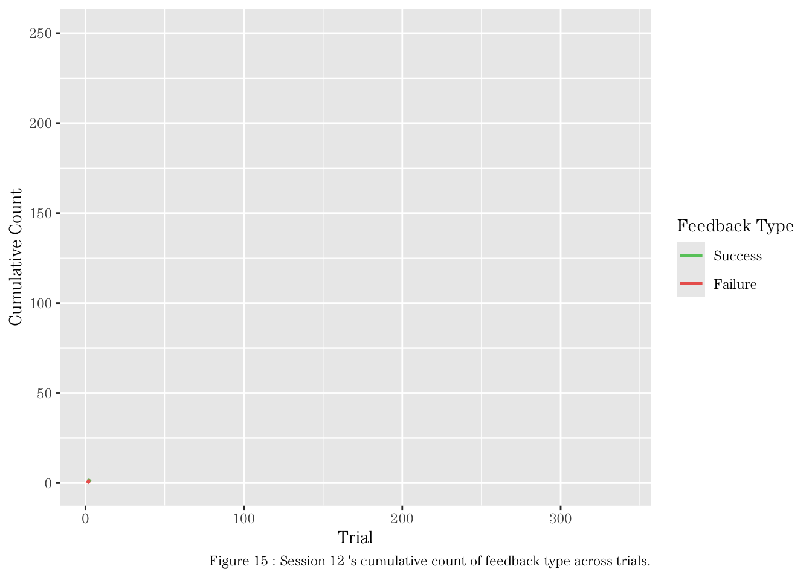

```{r setup, include=FALSE}
knitr::opts_chunk$set(echo = FALSE)
library(tidyverse)
library(knitr)
library(dplyr)
library(wesanderson)
library(ggplot2)
library(tibble)
library(gganimate)
library(gifski)
library(caret)
library(ROCR)
library(gridExtra)
library(shiny)
library(plotly)
library(tibble)
library(showtext)
theme_set(
  theme_gray(base_family = "ITC Century Light")
)
```

<style type="text/css">
body {
  font-family: 'ITC Century Light', sans-serif;
}

h1, h2, h3, h4, h5, h6 {
  font-family: 'ITC Century Light', sans-serif;
}

h1.title {
  font-size: 28px;
}

.title, .author, .date {
  text-align: center;
}

</style>

## Abstract

This project report utilizes a subset of data from the Steinmetz et al. (2019) research study. The goal of this report is to explore predictors and their relationship with feedback type, integrate the data, and train a model that predicts the feedback type.

## Introduction


The original experiment conducted by Steinmetz et al. (2019) involved 39 sessions across 10 different mice, investigating the relationship between sensory stimuli, neural activity, and feedback outcomes. Each session comprised several hundred trials in which visual stimuli were randomly presented on two screens positioned on either side of the mice. These stimuli varied in terms of contrast levels, with values in {0, 0.25, 0.5, 1}, where 0 indicated the absence of a stimulus. The mice were required to make decisions based on the visual stimuli, using a wheel controlled by their forepaws. After making their decisions, feedback (a reward or penalty) was administered based on the outcome of their responses. The feedback type was determined by the following rules:

* When the left contrast was greater than the right contrast, success (1) occurred if the mouse turned the wheel to the right and failure (-1) if it turned the wheel to the left.
* When the right contrast was greater than the left contrast, success (1) occurred if the mouse turned the wheel to the left and failure (-1) if it turned the wheel to the right.
* When both left and right contrasts were zero, success (1) occurred if the mouse held the wheel still and failure (-1) if it moved the wheel.
* When the left and right contrasts were equal but non-zero, success (1) or failure (-1) was randomly assigned with equal probability (50%).

According to the study findings, performance was found to be most accurate when stimuli appeared on a single side at high contrast, however, performance decreased in more challenging conditions, such as when stimuli were of low contrast or when stimuli of similar but unequal contrasts were presented (Steinmetz et al., 2019). In these challenging cases, reaction times were longer.

The dataset used in this report includes data from 18 sessions across 4 mice, focusing on visual stimuli and the corresponding feedback type. The primary objective of this report is to develop a predictive model that can accurately predict the feedback type based on various predictor variables, such as contrast differences between stimuli, neural spike counts, and other session-related features. Feedback type is a binary outcome, where a value of `1` represents a `Success` and `-1` represents a `Failure`. By exploring the relationships between these variables, this model aims to provide insights into how neural activity and sensory stimuli influence feedback outcomes and decision-making.

## Exploratory Analysis

```{r dataset, eval=TRUE}
session=list()
for(i in 1:18){
  session[[i]]=readRDS(paste('./STA141AProject/Data/session', i, '.rds', sep=''))
}
```

The data contains 18 sessions with 4 different mice. The table below includes the number of brain areas and neurons observed, the number of trials in a session, the number of successes and failures, and the success rate for that session.

```{r table1}
n.session=length(session)

meta = tibble(
  session_id = 1:18,
  mouse_name = rep('name', n.session),
  date_exp = rep('dt', n.session),
  n_brain_area = rep(0, n.session),
  n_neurons = rep(0, n.session),
  n_trials = rep(0, n.session),
  n_successes = rep(0, n.session),
  n_failures = rep(0, n.session),
  success_rates = rep(0, n.session)
) 

colnames(meta) = c("Session", "Mouse", "Date", "Brain Areas", "Neurons", "Trials", "Successes", "Failures", "Success Rate")

for(i in 1:n.session){
  tmp = session[[i]];
  meta[i,1] = i;
  meta[i,2] = tmp$mouse_name;
  meta[i,3] = tmp$date_exp;
  meta[i,4] = length(unique(tmp$brain_area));
  meta[i,5] = dim(tmp$spks[[1]])[1];
  meta[i,6] = length(tmp$feedback_type);
  meta[i,7] = sum(tmp$feedback_type == 1);
  meta[i,8] = sum(tmp$feedback_type == -1);
  meta[i,9] = sum(tmp$feedback_type == 1)/length(tmp$feedback_type)
}

kable(meta, format="html", table.attr="class='table table-striped'", digits=2, caption="Figure 1: Overall summary of data across all sessions.") 
```

To get another idea of the caption, below is another table to summarize the data into each mouse:

```{r table2}
condensed_meta = meta %>%
  group_by(Mouse) %>%
  summarise(
    total_sessions = n(),
    total_trials = sum(Trials),
    total_brain_n = sum(`Brain Areas`),
    total_neurons = sum(Neurons),
    avg_success_rate = mean(`Success Rate`, na.rm=TRUE)
  )

colnames(condensed_meta) = c("Mouse", "Total Sessions", "Total Trials", "Total Brain Areas", "Total Neurons", "Average Success Rate")

kable(condensed_meta, format="html", table.attr ="class='table table-striped'", digits=2, caption="Figure 2: Summary of data across mice.")
```

Let's first explore each contrast pair and its relationship to feedback type between session.

```{r session plot1, fig.align='center'}
bar_plot_contrasts = function(sessions){
  contrast_data = map_dfr(1:length(sessions), function(i){
    tibble(
      session_id = i,
      contrast_pairs = paste(sessions[[i]]$contrast_left, sessions[[i]]$contrast_right, sep = ","),
      feedback_type = as.factor(sessions[[i]]$feedback_type)  
    ) %>%
      group_by(session_id, contrast_pairs, feedback_type) %>%
      summarise(count=n(), .groups="drop")
  })
  
  ggplot(contrast_data, aes(x=count, y=contrast_pairs, fill=feedback_type)) +
    geom_bar(stat="identity") +  
    labs(title="Distribution of Contrast Pairs by Feedback Type", x="Count", y="Contrast (Left, Right)", fill="Feedback Type", caption="Figure 3: 1 = Success, -1 = Failure") + 
    facet_wrap(~session_id, ncol=9) +
    theme(axis.text=element_text(size=5), strip.text=element_text(size=8), plot.margin=unit(c(0.2, 0.2, 0.2, 0.2), "cm")) +
    scale_x_continuous(expand=expansion(mult=c(0.05, 0.2))) +
    scale_fill_manual(values=c("1"="#67c86b", "-1"="#eb655d"))
}

bar_plot_contrasts(session)
```

We can see that contrast pairs with a difference of 0 tend to be more random and inconsistent in pattern, which corresponds to the findings in the study.

Here, I also want to investigate feedback type, neural activity, such as average neuron spike and brain areas activated, and their changes across trials. 

```{r session plot2}
cols = c("#FF0000", "#00A08A", "#F2AD00", "#5BBCD6")

three_plots_summary = map_dfr(1:length(session), function(i) {
  tibble(
    session_id = i,
    mouse_name = session[[i]]$mouse_name,
    success_rate = sum(session[[i]]$feedback_type == 1)/length(session[[i]]$feedback_type),
    avg_spike = mean(sapply(session[[i]]$spks, function(x) mean(x, na.rm=TRUE))),
    n_brain_areas = unique(session[[i]]$brain_area)
  )
})

# feedback avg across session
p1 = ggplot(three_plots_summary, aes(x=session_id, y=success_rate, fill=mouse_name)) +
  geom_bar(stat="identity") + 
  labs(x="Session", y="Avg Success Rate", fill="Mouse") +
  scale_x_continuous(breaks = 1:18) +
  scale_y_continuous(limits = c(0, 1)) +
  scale_fill_manual(values=cols) 

# avg brain spike out of all neurons in session 
p2 = ggplot(three_plots_summary, aes(x=session_id, y=avg_spike, fill=mouse_name)) +
  geom_bar(stat="identity") +
  labs(x="Session", y="Avg Spike", fill="Mouse") +
  scale_x_continuous(breaks = 1:18) +
  scale_fill_manual(values=cols) 

# brain areas activated in each session
p3 = ggplot(three_plots_summary, aes(x=session_id, y=n_brain_areas, color=mouse_name)) +
  geom_point(size=1) +
  labs(x = "Session", y = "Brain Areas", color="Mouse") +
  scale_x_continuous(breaks = 1:18) +
  scale_color_manual(values=cols) +
  theme(axis.text.y=element_text(size=4))
```

```{r dropdown1}
ui = fluidPage(
  tags$head(tags$style('body {font-family: ITC Century Light;}')),
  
  sidebarLayout(
    sidebarPanel(
      selectInput("plot_selection", "Select a plot to display:", 
                  choices = c("Figure 4: Feedback Average", "Figure 5: Avg Brain Spike", "Figure 6: Brain Areas"))
    ),
    
    mainPanel(
      plotlyOutput("plot_output")
    )
  )
)

server = function(input, output) {
  
  output$plot_output = renderPlotly({
    if(input$plot_selection == "Figure 4: Feedback Average") {
      ggplotly(p1)
    } else if(input$plot_selection == "Figure 5: Avg Brain Spike") {
      ggplotly(p2)
    } else if(input$plot_selection == "Figure 6: Brain Areas") {
      ggplotly(p3)
    }
  })
}

shinyApp(ui=ui, server=server)
```

The average success rate of feedback type seems to gradually increase over the course of the 18 sessions. This pattern is disrupted in the average spike graph and shows no particular trend, however, the mouse `Lederberg` seems to have had the highest historical average spikes within a session and the highest average success rate across trials within its session. The brain area activity plot also shows a slight difference for `Lederberg`, who tends to have a few more brain areas activated compared to the other mice. Since the different mice may play a more important factor in the prediction model, it will be included as one of the factors.

Using session 7 to get an idea of the data within two trials, one with success (Trial 1) and one with failure (Trial 2), I'll be using a raster plot to visualize the neural behavior of when neurons spike. 

```{r between trials, fig.align='center'}
par(family = "ITC Century Light")

raster_plot = function(time, spikes, trial) {
  spike_data = which(spikes==1, arr.ind=TRUE) # arr.ind is column indexes for time bin indexing
  time_data = time[spike_data[,2]]

    plot(time_data, spike_data[,1],
       pch = "|", cex=0.5,
       xlab="Time", ylab = "Neurons",
       col="blue")
    caption = paste("Raster Plot of Neural Activity for Trial", trial)
    mtext(paste("Figure", 6+trial, ":", caption), side=1, line=4, cex=0.8, adj=1)
}

raster_plot(session[[7]]$time[[1]], session[[7]]$spks[[1]], 1)
raster_plot(session[[7]]$time[[2]], session[[7]]$spks[[2]], 2)
```
  
Trial 1 displays slightly more activity on the graph compared to Trial 2, a possible noteworthy observation since the two have different feedback types.

To explore the neural activity across trials, I'll be taking the sessions of one mouse, Forssmann, as an example. The graphs below describe the average firing rate of neurons in relation to contrast difference and feedback type.   

```{r changes across trials}
# spike data vs contrast difference vs feedback type
spike_vs_contrast_feedback = function(session) {
  trial_data = lapply(1:length(session$spks), function(trial_index) {
    spikes = session$spks[[trial_index]]
    feedback_type = session$feedback_type[trial_index]
    contrast_left = session$contrast_left[trial_index]
    contrast_right = session$contrast_right[trial_index]
    contrast_diff = abs(contrast_left - contrast_right)
    
    firing_rate = rowMeans(spikes)
    
    data.frame(
      con_diff = contrast_diff,
      fire_rate = firing_rate,
      f_type = factor(feedback_type, levels=c(1, -1), labels=c("Success", "Failure"))
    )
  })
  
  combined_data = bind_rows(trial_data)
  
  combined_data %>%
    group_by(con_diff, f_type) %>%
    summarise(mean_fire_rate = mean(fire_rate), .groups="drop") %>%
    ggplot(aes(x=as.factor(con_diff), y=mean_fire_rate, fill=f_type)) +
    geom_bar(stat="identity", position=position_dodge(width=0.7)) +
    labs(x="Contrast Difference (|Left - Right|)", 
         y="Mean Firing Rate", 
         fill="Feedback Type") +
    ggtitle("Mean Spike Data vs Contrast Difference vs Feedback Type") +
    scale_fill_manual(values=c("Success"="#67c86b", "Failure"="#eb655d")) +
    scale_y_continuous(limits = c(0, 0.04))

}

p4 = spike_vs_contrast_feedback(session[[4]])
p5 = spike_vs_contrast_feedback(session[[5]])
p6 = spike_vs_contrast_feedback(session[[6]])
p7 = spike_vs_contrast_feedback(session[[7]])
```

```{r dropdown2}
ui2 = fluidPage(
  tags$head(tags$style('body {font-family: ITC Century Light;}')),
  
  sidebarLayout(
    sidebarPanel(
      selectInput("plot_selection", "Select a plot to display:", 
                  choices = c("Figure 9: Session 4", "Figure 10: Session 5", "Figure 11: Session 6", "Figure 12: Session 7"))
    ),
    
    mainPanel(
      plotlyOutput("plot_output")
    )
  )
)

server2 = function(input, output) {
  
  output$plot_output = renderPlotly({
    if(input$plot_selection == "Figure 9: Session 4") {
      ggplotly(p4)
    } else if(input$plot_selection == "Figure 10: Session 5") {
      ggplotly(p5)
    } else if(input$plot_selection == "Figure 11: Session 6") {
      ggplotly(p6)
    } else if(input$plot_selection == "Figure 12: Session 7") {
      ggplotly(p7)
    }
  })
}

shinyApp(ui=ui2, server=server2)
```

It seems that overall, the average firing rate for success across Forssmann's sessions are slightly higher than the average firing rate when trials results in failures. However, the increment is minimal and may not be a significant factor in the data.

The graph below describes the average success rate between sessions for each mice. We can see that Cori's success rate has the historically lowest rate, but slowly increases over sessions. Both Hench and Lederberg begin at a rate that middles in their data, but ends on the highest average rate out of all their sessions. Only Forssman ends on a lower success rate compared to his other rates. From the stacking of the line plots, it's shown again how over the sessions, from 1 to 18, success rate slowly increases.

```{r homogeneity/heterogeneity across sessions/mice, fig.align='center'}
meta_normalized = meta %>%
  group_by(Mouse) %>%
  mutate(Session=Session-min(Session)+1) %>%
  ungroup() 

ggplot(meta_normalized, aes(x=Session, y=`Success Rate`, color=Mouse, group=Mouse)) +
  geom_line(linewidth=1) + 
  geom_point(size=2) +  
  labs(x="Session", y="Success Rate", color="Mouse", caption="Figure 13: Success rates calculated as proportion of successes during each session.") +
  ggtitle("Success Rate Over Sessions for Each Mouse") +
  scale_color_manual(values=cols)
```

To explore feedback type similarities and differences further between sessions, I'll be using sessions 8 (Hench) and 12 (Lederberg) to compare. Due to RAM constraints, I am unable to visualize additional sessions such as for Cori and Forssmann.

```{r animated1, fig.align='center'}
cumulative_feedback_animation = function(session, fig, num) {
  feedback_data = data.frame(
    trial = 1:length(session$feedback_type),
    feedback_type = session$feedback_type
  )
  
  feedback_data = feedback_data %>%
    mutate(
      cumulative_success = cumsum(feedback_type==1),
      cumulative_failure = cumsum(feedback_type==-1)
    )
  
  cumulative_data = feedback_data %>%
    pivot_longer(
      cols = c(cumulative_success, cumulative_failure),
      names_to = "type",
      values_to = "count"
    ) %>%
    mutate(
      type = factor(type, levels=c("cumulative_success", "cumulative_failure"),
                    labels=c("Success", "Failure"))
    )

  p = ggplot(cumulative_data, aes(x=trial, y=count, color=type, group=type)) +
    geom_line(linewidth=1) +
    scale_color_manual(values=c("Success"="#67c86b", "Failure"="#eb655d")) +
    labs(x="Trial", y="Cumulative Count", color="Feedback Type", caption=paste("Figure", fig, ": Session", num, "'s cumulative count of feedback type across trials.")) 
  
  animated_cumulative_feedback = p + 
    transition_reveal(trial) +
    ease_aes('linear')
  
  animate(animated_cumulative_feedback, nframes=80, fps=10, 
          renderer=gifski_renderer(paste("cumulative_feedback_animation_session_", num, ".gif", sep = "")),
          end_pause=20)}

cf1 = cumulative_feedback_animation(session[[8]], 14, 8)
cf2 = cumulative_feedback_animation(session[[12]], 15, 12)



```

Both graphs are relatively similar to one another, however, Hench's failure rate line ends slightly higher and begins at a similar rate as the cumulative success count. Lederberg's line diverges quicker, but since the lines are ultimately similar, the different mice may not be a significant factor. This is corroborated by the similar success rates between their averaged sessions. 

## Data Integration

To integrate all session data into one data frame, I'll be averaging the number of spikes in each trial. My final data frame to be used in prediction modeling includes the following variables: `mouse_name`, `avg_spikes`, `contrast_left`, `contrast_right`, `contrast_diff`, `feedback_type`, `brain_areas`, and `session_ID`. The `contrast_diff` is the `abs()` of the left minus right contrast and `brain_areas` are the total number of brain areas activated in one session. Each row of the data frame represents one trial, as shown below.


```{r data integration}
integrate_trials = function(session) {
  trials_all = tibble()
  
  for(i in 1:length(session)){
    n_trials = length(session[[i]]$feedback_type)
    avg_spikes_all = numeric(n_trials)
    
    for(j in 1:n_trials){
      spks_trial = session[[i]]$spks[[j]] 
      total_spikes = apply(spks_trial, 1, sum)
      avg_spikes_all[j] = mean(total_spikes)
    }
    session[[i]]$avg_spks = avg_spikes_all
  }
  
  for (i in 1:length(session)) {
    n_trials = length(session[[i]]$feedback_type)
    tmp = session[[i]];
  
    trials = tibble(
      mouse_name = rep('name', n_trials),
      avg_spks = rep(0, n_trials),
      contrast_left = rep(0, n_trials),
      contrast_right = rep(0, n_trials),
      contrast_diff = rep(0, n_trials),
      feedback_type = rep(0 ,n_trials),
      brain_areas = rep(0, n_trials),
      session_ID = rep(0, n_trials),
    )
    
    for(j in 1:n_trials){ 
      trials[j,1] = tmp$mouse_name;
      trials[j,2] = tmp$avg_spks[j];
      trials[j,3] = tmp$contrast_left[j];
      trials[j,4] = tmp$contrast_right[j];
      trials[j,5] = abs(tmp$contrast_left[j]-tmp$contrast_right[j]);
      trials[j,6] = tmp$feedback_type[j];
      trials[j,7] = length(tmp$brain_area);
      trials[j,8] = i
    }
    trials_all = rbind(trials_all, trials)
  }
  return(trials_all)
}

trials_all = integrate_trials(session)

col_names = c("Mouse Name", "Avg Spks", "Left Contrast", "Right Contrast", "Contrast Diff", "Feedback Type", "Brain Areas", "Session ID")
kable(head(trials_all, 10), format="html", table.attr="class='table table-striped'", digits=2, col.names=col_names, caption="Figure 16: Table of integrated data across sessions.") 
```

## Predictive Modeling

Logistic regression will be used to model the relationships in the data since we are trying to predict binary outcomes (feedback type). Included in the model as predictors are all columns except for `feedback_type`, the response variable, with `session_ID` as a factor. Below displays the confusion matrix and ROC curve, both indicating a moderate accuracy, but still not the best model. The AUC score for this model is 0.6914 with an accuracy rate of 0.7247.

```{r modeling}
set.seed(1)  

n = nrow(trials_all)  
indexes = sample(1:n, size=0.8*n) 

train_data = trials_all[indexes,]
test_data = trials_all[-indexes,]

log_model = glm(as.factor(feedback_type) ~ contrast_left+contrast_right+contrast_diff+avg_spks+brain_areas+as.factor(session_ID), data=train_data, family='binomial')
#summary(log_model)

predictions = predict(log_model, test_data, type="response")
predicted_outcome = as.numeric(ifelse(predictions>0.5, -1, 1))

conf_matrix = confusionMatrix(as.factor(predicted_outcome), as.factor(test_data$feedback_type), dnn=c("Prediction", "Reference"))

conf_data = as.data.frame(conf_matrix$table)
tile_matrix = ggplot(conf_data, aes(Reference, Prediction, fill=Freq)) +
  geom_tile() + 
  geom_text(aes(label=Freq)) +
  scale_fill_gradient(low="white", high="steelblue") +
  labs(x="Reference", y="Prediction", caption="Figure 17: Confusion matrix displayed as tiles.") +
  scale_x_discrete(labels=c("-1","1")) +
  scale_y_discrete(labels=c("-1","1")) 

accuracy = (sum(predicted_outcome != test_data$feedback_type)/length(predicted_outcome))
#accuracy

pr = prediction(predictions, test_data$feedback_type)
prf = performance(pr, measure="tpr", x.measure="fpr")

roc_data = data.frame(
  fpr = prf@x.values[[1]],  
  tpr = prf@y.values[[1]]   
)

roc_plot = ggplot(roc_data, aes(x=fpr, y=tpr)) +
  geom_line(color="blue", linewidth=1) +       
  geom_abline(slope=1, intercept=0, linetype="dashed", color="gray") +  
  labs(x="False Positive Rate", y="True Positive Rate", caption="Figure 18: ROC curve of logistics model on test data.") 

auc = performance(pr, measure="auc")
auc = auc@y.values[[1]]
#auc

require(gridExtra)
grid.arrange(tile_matrix, roc_plot, ncol=2)
```

## Prediction Performance

```{r test model, warning=FALSE, message=FALSE}
testing_data = list()
for(i in 1:2){
  testing_data[[i]]=readRDS(paste('./STA141AProject/test/test', i, '.rds', sep=''))
}

all_test = integrate_trials(testing_data)

pred_test = predict(log_model, all_test, type="response") 
outcome_test = as.numeric(ifelse(pred_test>0.5, -1, 1)) 

cm_test = confusionMatrix(as.factor(outcome_test), as.factor(all_test$feedback_type), dnn=c("Prediction", "Reference")) 

conf_data_test = as.data.frame(cm_test$table) 
tile_test = ggplot(conf_data_test, aes(Reference, Prediction, fill=Freq)) +
  geom_tile() + 
  geom_text(aes(label=Freq)) +
  scale_fill_gradient(low="white", high="lightpink") +
  labs(x="Reference", y="Prediction", caption="Figure 19: Confusion matrix displayed as tiles.") +
  scale_x_discrete(labels=c("-1","1")) +
  scale_y_discrete(labels=c("-1","1")) 

accuracy_test = (sum(outcome_test != all_test$feedback_type)/length(outcome_test))
#accuracy_test

pr_test = prediction(as.numeric(pred_test), all_test$feedback_type)
prf_test = performance(pr_test, measure="tpr", x.measure="fpr")

roc_test = data.frame(
  fpr = prf_test@x.values[[1]],  
  tpr = prf_test@y.values[[1]]   
)

test_plot = ggplot(roc_test, aes(x=fpr, y=tpr)) +
  geom_line(color="red", linewidth=1) +       
  geom_abline(slope=1, intercept=0, linetype="dashed", color="gray") +  
  labs(x="False Positive Rate", y="True Positive Rate", caption="Figure 20: ROC curve of logistics model on prediction performance data.") 

auc_test = performance(pr_test, measure="auc")
auc_test = auc_test@y.values[[1]]
#auc_test

require(gridExtra)
grid.arrange(tile_test, test_plot, ncol=2)
```

The model used draws similar results from the prediction performance data in comparison to my test data set with all 18 sessions. The accuracy rate is 0.675 and the AUC score is 0.7002. Both values are slightly less than the values seen in the predictive modeling section, but it can still be considered a moderately okay model.

## Discussion

Both the prediction model and prediction performance data set performed moderately accurate, with the model and data integration methods having room for improvement. The accuracy rate for the model on all sessions was 0.72 and the accuracy rate for the prediction performance data set, `test1` and `test2`, was 0.68.

## Contributions

Steinmetz, N.A., Zatka-Haas, P., Carandini, M. et al. Distributed coding of choice, action and engagement across the mouse brain. Nature 576, 266–273 (2019). https://doi.org/10.1038/s41586-019-1787-x

ChatGPT, OpenAI: https://chatgpt.com/share/67d8943c-8054-800c-8776-84d0986a9a55

## Appendix

```{r ref.label=knitr::all_labels(), echo=TRUE, eval=FALSE}
```

<div class="tocify-extend-page" data-unique="tocify-extend-page" style="height: 0;"></div>
